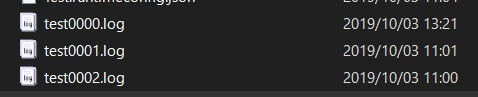
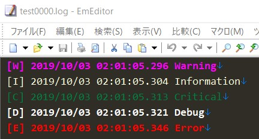

# FileLogger  [](https://www.nuget.org/packages/Punio.FileLogger/) [](https://github.com/punio/FileLogger/blob/master/LICENSE)

File logger for [Microsoft.Extensions.Logging](https://www.nuget.org/packages/Microsoft.Extensions.Logging)

This log writer is simple and not fast.This for me.

# Functions

- Files switch by size

- Keep logs for the specified number of files

- Because it is a synchronous process, it may stop if I / O is slow


# Install
```
PM> Install-Package Punio.FileLogger
```

# Usage

## Configure appsettings.json
Set it below File in the Logging section.

```json
  "Logging": {
    "LogLevel": {
      "Default": "Debug"
    },
    "File": {
      "LogLevel": "Debug",
      "FileName": "test{0:d4}.log",
      "MaxFileSize": 10240, /* 10 kbyte */
      "RetainFileCount": 3,
      "LocalTime": true
    }
  }
```
```c#
await new HostBuilder()
    .ConfigureAppConfiguration((hostContext, configApp) =>
    {
        // ・・・
        configApp.AddJsonFile("appsettings.json");
    })
    .ConfigureServices(services =>
    {
    })
    .ConfigureLogging((hostingContext, logging) =>
    {
        logging.AddConfiguration(hostingContext.Configuration.GetSection("Logging"));
        // ・・・
        logging.AddFileLogger();
    })
    .RunConsoleAsync();
```

## Configure in code
Or set on code.

```c#
        // ・・・
    .ConfigureLogging((hostingContext, logging) =>
    {
        // ・・・
        logging.AddFileLogger(config =>
        {
            config.OutputFolder = Path.GetDirectoryName(Process.GetCurrentProcess().MainModule.FileName);
            config.FileName = "{0}.log";
            config.LogLevel = LogLevel.Debug;
        });
    })
```

## Settings
| Key | Type | Default | Info
|---|---|---|---|
|OutputFolder|string|Where the exe is located|Specify the folder to save the log file
|FileName|string|{0:d2}.log|Specify the file name.```{0}``` will be replaced by counter.
|MaxFileSize|int|524288 (500kb)|Specify the maximum size of one file.If this size is exceeded, the file is rotated.Unit is byte.
|RetainFileCount|int|10|Maximum number of files to save."0" to "RetainFileCount-1" files can be created
|LocalTime|bool|false|The date and time to be output to the log is output in local time.


# Explanation

It uses the same alias `File` as other famous file loggers.But this logger is not so powerful.

This logger will save to a new file if the file size exceeds the specified value.The numerical value of the file name is 0, and the older the file, the larger the numerical value.

**For appsettings.json above**




The output format is like this

```c#
_logger.LogWarning("Warning");
_logger.LogInformation("Information");
_logger.LogCritical("Critical");
_logger.LogDebug("Debug");
_logger.LogError("Error");
_logger.LogTrace("Trace");
```

    [W] 2019/10/03 02:01:06.296 Warning
    [I] 2019/10/03 02:01:06.304 Information
    [C] 2019/10/03 02:01:06.311 Critical
    [D] 2019/10/03 02:01:06.320 Debug
    [E] 2019/10/03 02:01:06.344 Error
    [T] 2019/10/03 02:01:06.344 Trace

Identifies the log type with the first 3 characters including brackets.Date and time and log string follow.
When there is an exception, a little exception information is also given.

    [E] 2019/10/03 02:01:08.343 Error
    System.Exception: Exception
    at Test.TestService.OnTimer() \TestService.cs:line 42


**If you set it with a familiar text editor, you will be able to send a fun life of log analysis**
